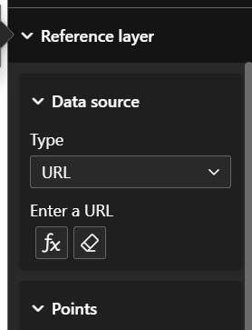
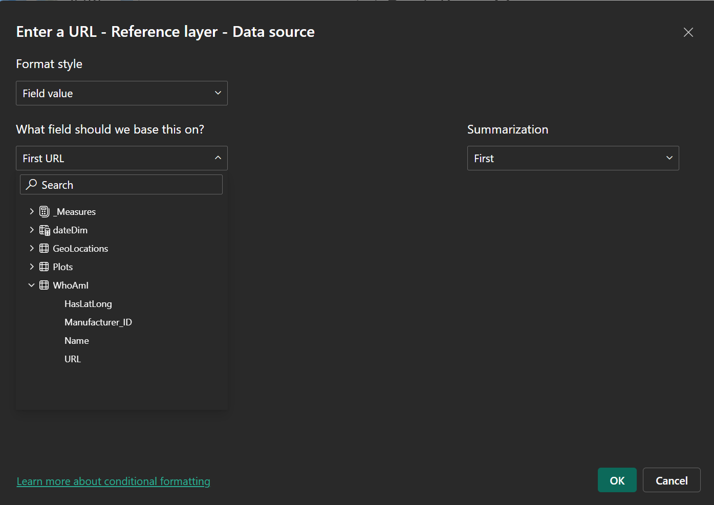
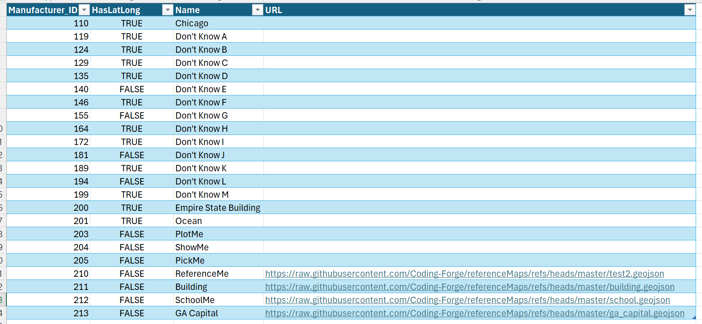
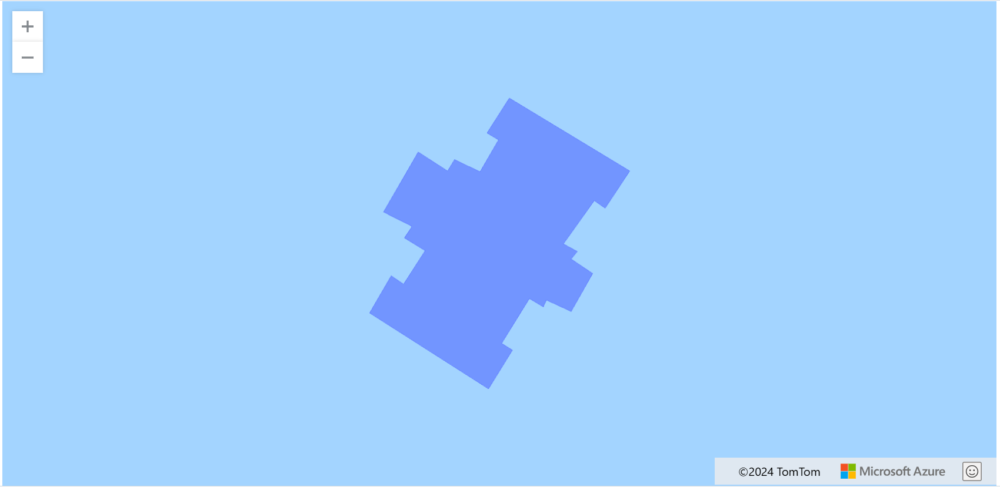

# Reference Layers for Azure Maps  

With the release of Power BI September edition, Azure Maps now supports dynamic reference labels. This can only be accomplished by using URL address for the reference layer. One can also pass in parameters to the URL to dynamically control layers.  

The following maps are publicly available to use for demonstration puruposes. The maps can be used within Azure Maps. Click on the format visual blade while the Azure Maps is in focus.  
  
You will need to click on the function button to open the dialog.  
  
It works best if you have a single table that holds your URLs. This will reduce any potential error due to replication of the URL.  
  
Here you can see that I created a reference layer that outlines the GA Capital building. The geojson file has modified the values to put the reference layer into the middle of the Atlantic however it originally started over the GA Capital building.  
  

using https://geojson.io for making polygons  
